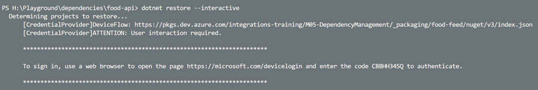

# AZ-400 - Using Artifacts

- Checkout commit with tag `initial-project` and explaing the relation between the two projects in `food-api.csproj`
- Explain and run `az-pipelines/publish-foodcalc.yml` and mention GitVersion settings
- Explain [Azure Artifacts Credential Provider](https://github.com/microsoft/artifacts-credprovider) and [Device Auth Flow](https://docs.microsoft.com/en-us/azure/active-directory/develop/v2-oauth2-device-code)
- Checkout commit with tag `project-using-feed` and explaing nuget.config and updated package ref

    `restore:`

    

    `*.csproj:`
    ```xml
    <Project Sdk="Microsoft.NET.Sdk.Web">
        <PropertyGroup>
            <TargetFramework>net6.0</TargetFramework>
        </PropertyGroup>
        <ItemGroup>
            ...
            <PackageReference Include="FoodCalculations" Version="0.1.0" /> 
        </ItemGroup>
    </Project>
    ```
- Explain and run `consume-foodcalc.yaml`
